## Mdot's Custom Trails Guide

This guide assumes you have already followed [angeliod0103's Guide to making your own sabers](https://bs.assistant.moe/Sabers/). If you haven't looked at that yet, please do so before continuing with this guide.

## Custom Trail Script

- Select the RightSaber and LeftSaber game objects and add the Custom Trail script by clicking on the "Add Component" button in the inspector.

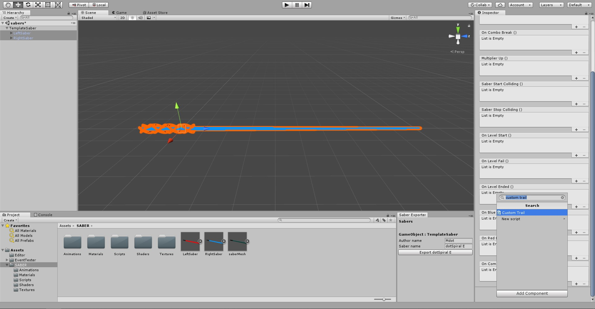

- Then unselect the RightSaber game object (We'll only look at the left saber for now and copy everything over to the right saber later).

- The component should look something like this :

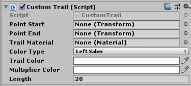

- Point Start and Point End refer to the points on the saber where the trails will start and end

- The trail material will dictate what the trail actually looks like

- The Color Type refers to which color the trail will follow. If it's set to Left Saber, it will follow the color that the player has set for their left saber. If it's set to Custom color it will override what the player has set and use the color that you set yourself in the Trail Color field.

- The Length determines how long your trail will be. For most trails 20 is a bit too high, so chances are you will want to lower it, but feel free to experiment beforehand

 *It is also possible to have more than one trail on each saber (For eg: [SnowResortPro](https://modelsaber.com/Sabers/?id=1571583763)). All you have to do is add another Trail script to each saber and repeat the next few steps for the second trail.*

## Setting up the start and end points

- Right-click the LeftSaber gameobject in the hierarchy and and create 2 emptys

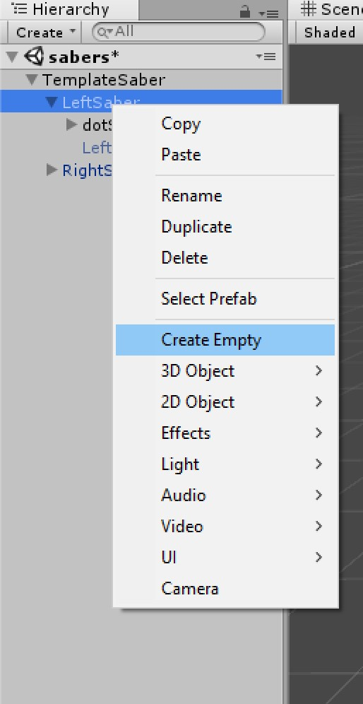

- Rename them to TrailStart and TrailEnd respectively (They can be called whatever you want. Just make sure you can easily differentiate them).

- Move TrailEnd across the Z axis so that it's right at the tip of your saber. Then move TrailStart to the point where you want your trail to start showing up

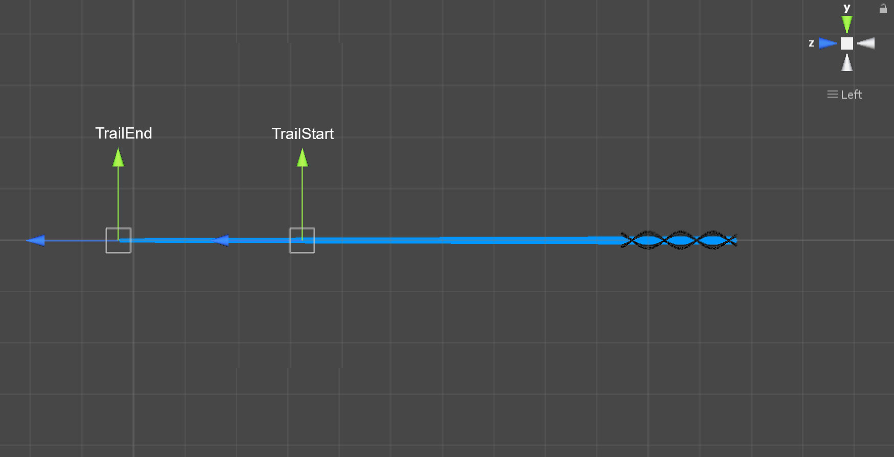

- Your start point may be further up or down your saber. It depends on how large (in width) you want your trail to be. 

- Go back to your LeftSaber gameobject and drag the 2 emptys you created from the hierarchy to Point Start and Point End respectively.

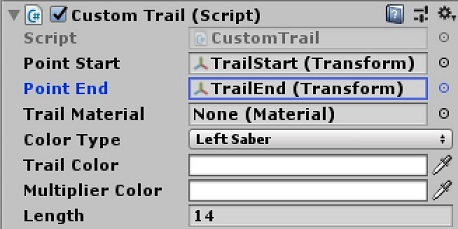

- You can easily copy these over to the RightSaber by selecting both your emptys and pressing Ctrl + D

- Then drag the newly created points **onto** the RightSaber gameobject

- Select the RightSaber gameobject and drag the newly created empties into the Point Start and Point End fields.

- Also don't forget to set color type to Right Saber if you aren't using the Custom Color option for your trail.

- It should look something like this

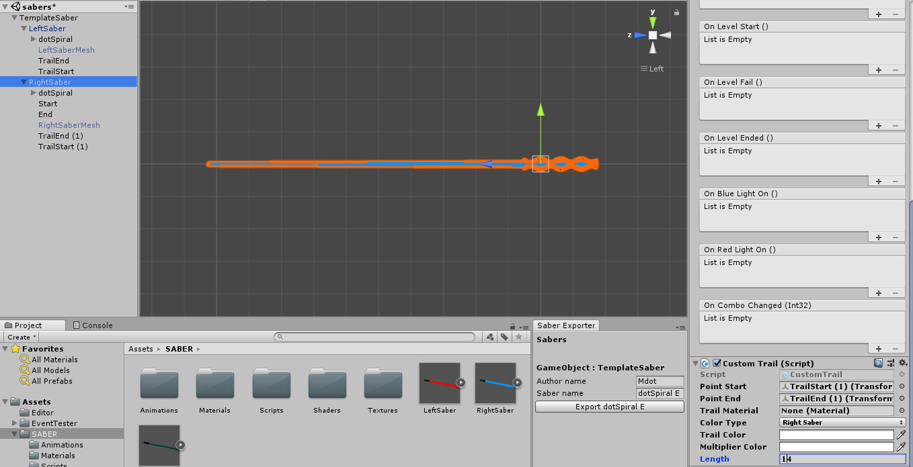

## Setting up the Trail Material

- First you will need to find a trail texture. This dictates the "design" of your trail. They can be created using almost any photo editing software (Photoshop, paint, GIMP, etc). 

- It is preferrable to use a file format that supports transparancy, but other formats will work too as long as it can be handled by Unity.

- Here is an example of the trail that's used in dotSpiral V1

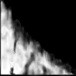

	- Since I used an additive shader, black will count as transparancy

- Click on your trail texture and set Wrap Mode to Clamp and set Compression to none. **Then press Apply**

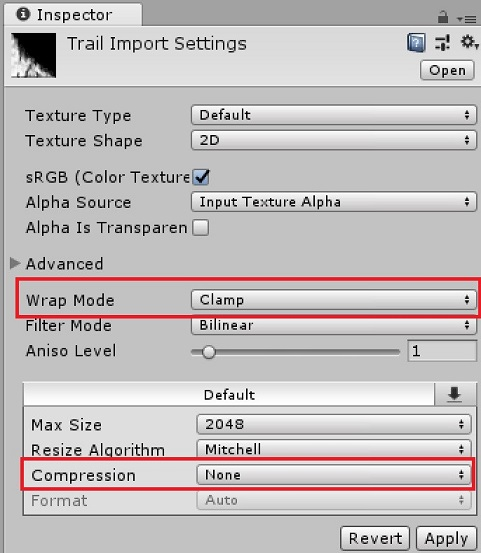

- After that, In your project files, Right-click > Create > Material. Name this whatever you like (as long as it can be differentiated from the other materials).

- We will use the Particles/Additive shader for this trail. You could also experiment with other shaders depending on what effect you're going for. 
	
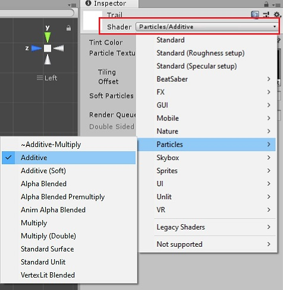

- Then we can add our trail texture to the material by adding it to the Particle Texture field

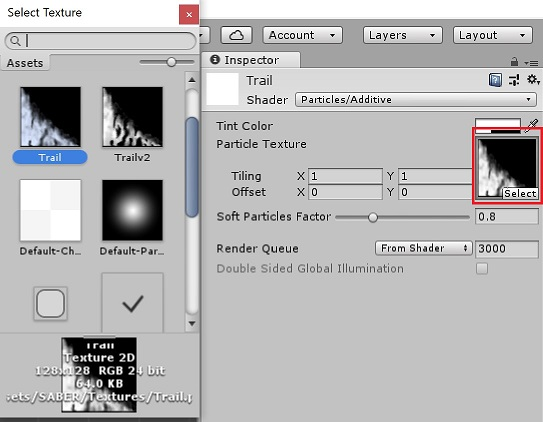

- In the Tint Color field, you can adjust the alpha slider to determine how dark / bright your trail will be.

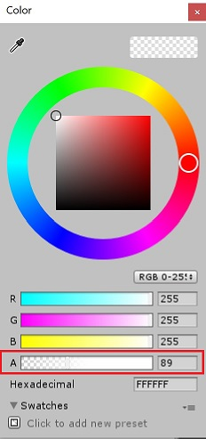

- We're almost done! Now all you gotta do is add the trail material to both sabers.

- Select both sabers in your hierarchy and drag the material onto the Trail Material field.

- Each trail component should look something like this :

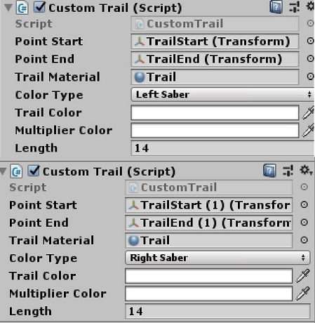

- You can now export your sabers and use them in-game!

**Before you upload your sabers to [Modelsaber](https://modelsaber.com/Sabers/), make sure you playtest your sabers. Maybe even have someone else look at it beforehand. They may be able to spot something that you may have not caught yourself.**

